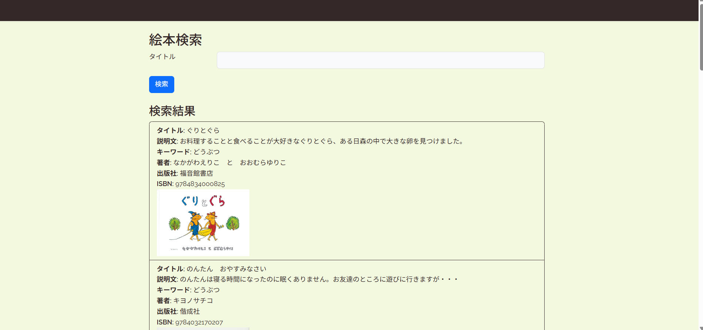
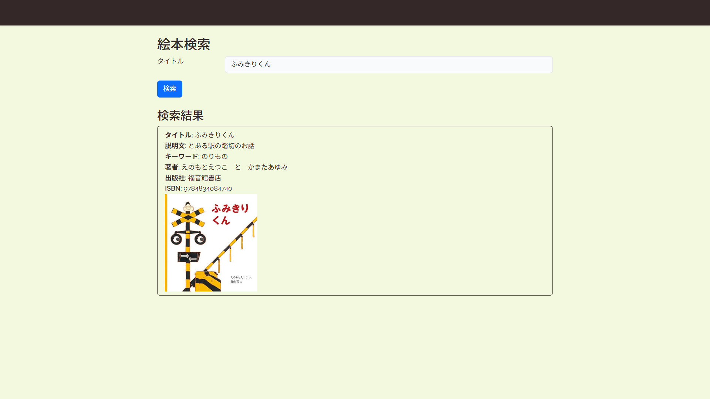

# 📖 絵本検索アプリ

## 📚 概要
絵本のタイトルを入力して、絵本の情報（説明、著者、出版社、ISBN、表紙画像など）を検索できるアプリです。  
育児中の保護者や、絵本に興味がある方が簡単に情報を調べられるようにという思いから制作しました。

## 🔧 使用技術
- Laravel 9.52.20
- PHP 8.2.27
- MySQL 5.7.44
- Bladeテンプレート
- Tailwind CSS
- Visual Studio Code（開発環境）

## 🖼️ 画面イメージ
### トップページ

### 検索結果ページ

## ⏳ 制作期間
約6週間（2025年4月中旬〜5月下旬）

## 👣 工夫した点・苦労した点
- LaravelでのAPI連携に苦戦し、一度はGoogle Books APIも検討しましたが、最終的には自作のデータベースを使用しました。
- Bladeでの表示や、検索フォームとの連携、データの整形に時間がかかりました。
- 一般ユーザー用と管理者用に分け、管理者が本の登録・修正等を行うことができるようにしています。
- Tailwind CSSでのスタイリングは今後さらにブラッシュアップ予定です。

## 📌 今後の予定
- 絵本のカテゴリ機能や評価機能の追加
- UIデザインの改善

## 💻 開発環境

開発はWindowsで行い、Visual Studio Codeを使用しました。  
ローカルサーバーはLaravelの `artisan serve` を用いて起動しています。

### 更新メモ
- 2025/09/15 タイトルやtextareaの行数を調整
- 学習継続中
